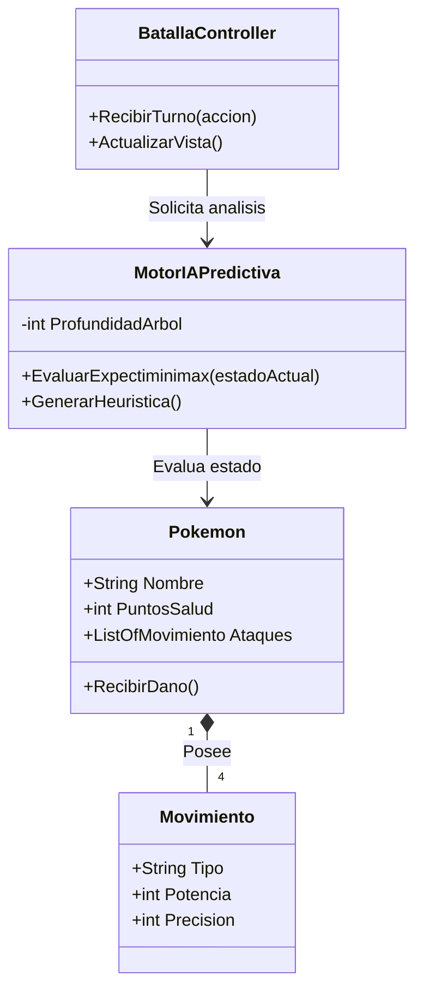
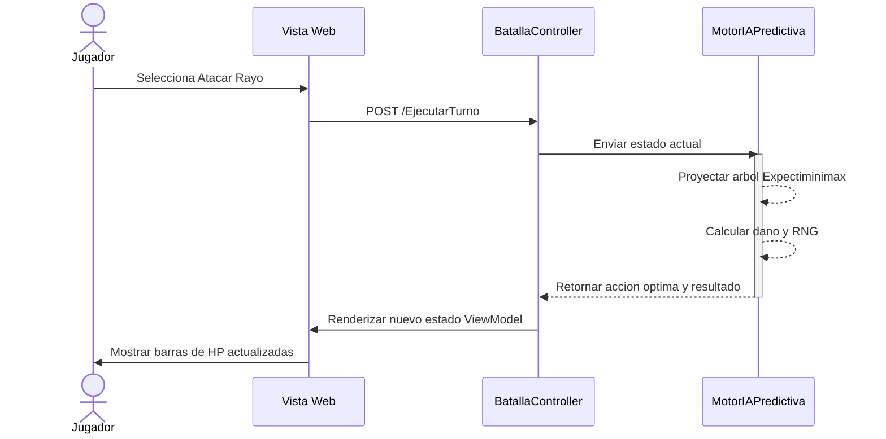
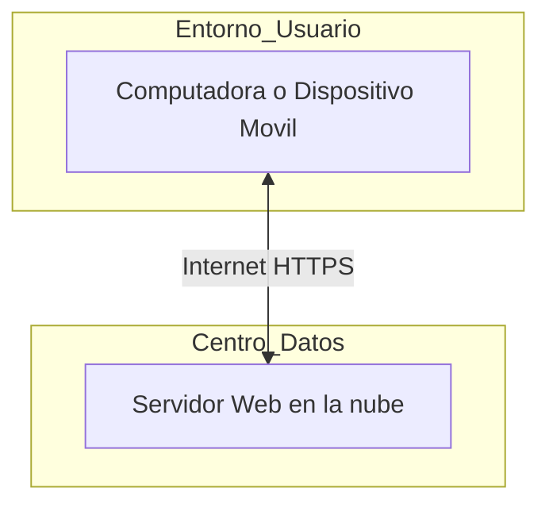
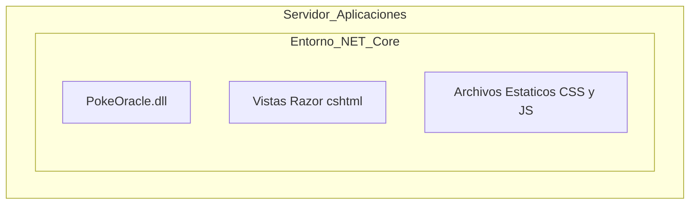

# ADR-02: Definicion de Vistas Arquitectonicas (Modelo 4+1 adaptado)

| Campo  | Valor |
|--------|-------|
| Autor  | David Alonso Romero Medina |
| Fecha  | 05/06/2026 |
| Estado | `Propuesto` |

---

## Contexto

Tras definir que PokeOracle utilizara el patron MVC en ASP.NET Core con un motor Expectiminimax para la logica de Inteligencia Artificial (ADR-01), es necesario documentar las perspectivas del sistema para los distintos perfiles tecnicos (desarrolladores, arquitectos y operaciones). Se requiere establecer como se estructura el codigo, como interactuan los componentes en tiempo de ejecucion y como se distribuira el software en la infraestructura de hardware, cumpliendo con los estandares de documentacion del proyecto.

---

## Decision

Se ha decidido implementar una adaptacion del **Modelo de Vistas Arquitectonicas** para representar el sistema desde 4 perspectivas fundamentales mediante diagramas de Mermaid: Logica, Procesos, Fisica y Despliegue.

### Por que?

Un solo diagrama C4 no es suficiente para explicar la complejidad del motor predictivo.
* La **Vista Logica** facilita el desarrollo al mapear las clases orientadas a objetos (Modelos).
* La **Vista de Procesos** es critica para entender el flujo asincrono y la evaluacion de arboles de decision turno por turno.
* Las **Vistas Fisica y de Despliegue** aseguran que los recursos del servidor web esten correctamente dimensionados para soportar los calculos algoritmicos sin saturar el entorno.

### Alternativas consideradas

| Alternativa | Por que la descarte |
|-------------|---------------------|
| **Mantener un unico diagrama general (C4 Nivel 2)** | No ofrece el nivel de detalle necesario para programar la interaccion exacta entre la IA y el Controlador, dejando ambiguedades en la implementacion. |
| **UML Completo (Casos de uso, Estados, Actividad)** | Generaria un exceso de documentacion innecesario para el tamano actual del simulador. |
| **Documentacion puramente textual** | Explicar el ciclo de eventos del Minimax sin diagramas de secuencia resulta confuso y propenso a errores de interpretacion. |

---

## Diagramas de las 4 Vistas

### 1. Vista Logica

### 2. Vista de Procesos

### 3. Vista Fisica

### 4. Vista de Despliegue

---

## Consecuencias

**Lo que gano:**
* **Consecuencia tecnica:** Al tener una Vista Logica clara, la programacion orientada a objetos en C# se agiliza enormemente, ya que se exactamente que atributos debe tener cada entidad antes de escribir la primera linea de codigo.
* **Consecuencia sobre el proceso:** Trabajar con la Vista de Procesos sirve como guia paso a paso para programar el Controlador, evitando saltarse pasos en la validacion de los turnos.

**Lo que pierdo o asumo:**
* **Limitacion tecnica:** Estos diagramas representan una foto fija del plan actual. Si se cambia radicalmente la arquitectura de la IA, habra que invertir tiempo en redibujar estos diagramas.
* **Deuda o riesgo:** La Vista Fisica y de Despliegue es actualmente muy sencilla. Si el simulador escala a miles de usuarios, habra que actualizarla para incluir balanceadores de carga y bases de datos relacionales.

---

## Declaracion de uso de IA

*Se declara el uso de herramientas de Inteligencia Artificial como asistentes de investigacion y validacion para el estructurado de codigo Mermaid y refinamiento tecnico de los diagramas arquitectonicos de este documento, manteniendo en todo momento la autoria y direccion logica del proyecto a cargo del desarrollador.*
