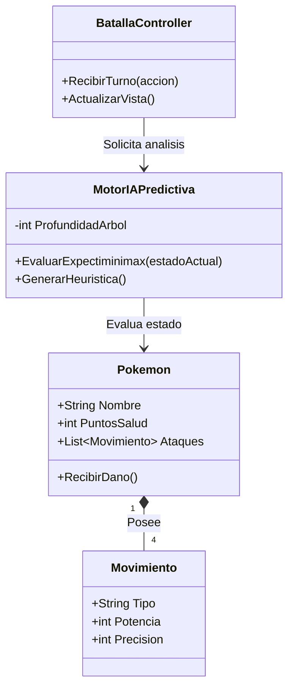

# ADR-02: Definición de Vistas Arquitectónicas (Modelo 4+1 adaptado)

| Campo  | Valor |
|--------|-------|
| Autor  | David Alonso Romero Medina |
| Fecha  | 05/06/2026 |
| Estado | `Propuesto` |

---

## Contexto

Tras definir que PokeOracle utilizará el patrón MVC en ASP.NET Core con un motor Expectiminimax para la lógica de Inteligencia Artificial (ADR-01), es necesario documentar las perspectivas del sistema para los distintos perfiles técnicos (desarrolladores, arquitectos y operaciones). Se requiere establecer cómo se estructura el código, cómo interactúan los componentes en tiempo de ejecución y cómo se distribuirá el software en la infraestructura de hardware, cumpliendo con los estándares de documentación del proyecto.

---

## Decisión

Se ha decidido implementar una adaptación del **Modelo de Vistas Arquitectónicas** para representar el sistema desde 4 perspectivas fundamentales mediante diagramas de Mermaid: Lógica, Procesos, Física y Despliegue.

### ¿Por qué?

Un solo diagrama C4 no es suficiente para explicar la complejidad del motor predictivo. 
* La **Vista Lógica** facilita el desarrollo al mapear las clases orientadas a objetos (Modelos).
* La **Vista de Procesos** es crítica para entender el flujo asíncrono y la evaluación de árboles de decisión turno por turno.
* Las **Vistas Física y de Despliegue** aseguran que los recursos del servidor web estén correctamente dimensionados para soportar los cálculos algorítmicos sin saturar el entorno.

### Alternativas consideradas

| Alternativa | Por qué la descarté |
|-------------|---------------------|
| **Mantener un único diagrama general (C4 Nivel 2)** | No ofrece el nivel de detalle necesario para programar la interacción exacta entre la IA y el Controlador, dejando ambigüedades en la implementación. |
| **UML Completo (Casos de uso, Estados, Actividad)** | Generaría un exceso de documentación (*Over-engineering*) innecesario para el tamaño actual del simulador. |
| **Documentación puramente textual** | Explicar el ciclo de eventos del Minimax sin diagramas de secuencia resulta confuso y propenso a errores de interpretación. |

---

## Diagramas de las 4 Vistas

### 1. Vista Lógica



### 2. Vista de Procesos

sequenceDiagram
    actor Jugador
    participant VistaWeb as Vista Web
    participant BatallaController
    participant MotorIAPredictiva
    
    Jugador->>VistaWeb: Selecciona Atacar (Rayo)
    VistaWeb->>BatallaController: POST /EjecutarTurno
    BatallaController->>MotorIAPredictiva: Enviar estado actual
    activate MotorIAPredictiva
    MotorIAPredictiva-->>MotorIAPredictiva: Proyectar arbol Expectiminimax
    MotorIAPredictiva-->>MotorIAPredictiva: Calcular dano y RNG
    MotorIAPredictiva-->>BatallaController: Retornar accion optima y resultado
    deactivate MotorIAPredictiva
    BatallaController->>VistaWeb: Renderizar nuevo estado (ViewModel)
    VistaWeb->>Jugador: Mostrar barras de HP actualizadas
```

### 3. Vista Física

flowchart TD
    subgraph Entorno_de_Usuario
        PC[Computadora / Dispositivo Movil]
    end

    subgraph Centro_de_Datos
        Server[Servidor Web / Host en la nube]
    end

    PC <-->|Internet / HTTPS| Server
```

### 4. Vista de Despliegue

flowchart TD
    subgraph Servidor_de_Aplicaciones
        subgraph Entorno_NET_Core
            DLL[PokeOracle.dll]
            Views[Vistas Razor - cshtml]
            Static[Archivos Estaticos - CSS y JS]
        end
    end


    ## Consecuencias

    ** Lo que gano:**
    * **Consecuencia técnica:** Al tener una Vista Lógica clara, la programación orientada a objetos en C# se agiliza enormemente, ya que sé exactamente qué atributos debe tener cada entidad (Pokemon, Movimiento) antes de escribir la primera línea de código.
    * **Consecuencia sobre el proceso:** Trabajar con la Vista de Procesos me sirve como guía paso a paso para programar el Controlador, evitando saltarme pasos en la validación de los turnos.

** Lo que pierdo o asumo:**
    * **Limitación técnica:** Estos diagramas representan una "foto fija" del plan actual. Si decido cambiar radicalmente la arquitectura de la IA más adelante, tendré que invertir tiempo en redibujar e iterar estos diagramas.
    * **Deuda o riesgo:** La Vista Física y de Despliegue es actualmente muy sencilla. Si el simulador escala a miles de usuarios, tendré que actualizarla para incluir balanceadores de carga y bases de datos relacionales, lo que incrementará la complejidad del despliegue.

    ---

## Declaración de uso de IA
*Se declara el uso de herramientas de Inteligencia Artificial como asistentes de investigación y validación para el estructurado de código Mermaid y refinamiento técnico de los diagramas arquitectónicos de este documento, manteniendo en todo momento la autoría y dirección lógica del proyecto a cargo del desarrollador.*