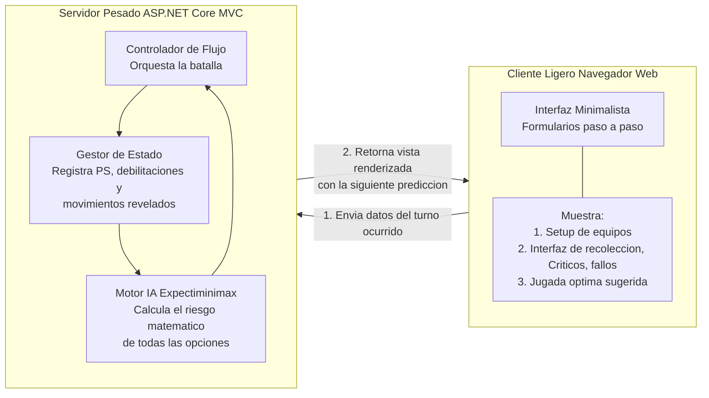

# ADR-03: Estilo Arquitectónico - Cliente-Servidor Thin Client

| Campo  | Valor |
|--------|-------|
| Autor  | David Alonso Romero Medina |
| Fecha  | 12/06/2026 |
| Estado | `Propuesto` |

---

## Contexto

El simulador PokeOracle requiere procesar un flujo de combate en tiempo real mediante un ciclo de turnos. El usuario debe ingresar la configuración inicial, como equipos y habilidades, y, turno a turno, reportar las acciones ocurridas como los movimientos del rival, golpes críticos, fallos o debilitaciones. Con cada nuevo dato, la Inteligencia Artificial debe recalcular el árbol de probabilidades para sugerir la siguiente jugada óptima. 

A nivel de experiencia de usuario, se ha determinado que la herramienta vivirá estrictamente como una aplicación web con una interfaz minimalista de fondo blanco, botones grises claros y detalles sutiles en pixel art, priorizando absolutamente la velocidad y precisión de la predicción algorítmica por encima de la carga visual o animaciones complejas en el navegador.

---

## Decisión

Se ha decidido adoptar el estilo arquitectónico **Cliente-Servidor**, implementando específicamente el patrón de **Cliente Ligero Thin Client y Servidor Pesado Thick Server**.

### ¿Por qué?

Este estilo resuelve perfectamente la necesidad de calcular probabilidades complejas sin trabar el dispositivo del usuario. 
Al utilizar un **Cliente Ligero**, el navegador web solo se encarga de renderizar la interfaz minimalista y los formularios paso a paso. No ejecuta lógica matemática. 
Todo el estado del combate y las decisiones algorítmicas se delegan al **Servidor Pesado**, el backend en ASP.NET Core. Cuando el jugador ingresa que el rival usó X movimiento y fue golpe crítico, esa información viaja al servidor, el cual tiene el poder de CPU necesario para ejecutar el algoritmo *Expectiminimax*, calcular miles de variables de primera generación en milisegundos y devolverle al cliente únicamente la respuesta final con la mejor jugada sugerida de forma fluida.

### Alternativas consideradas

| Alternativa | Por qué la descarté |
|-------------|---------------------|
| **Single Page Application SPA, React o Angular** | Añadiría un peso y complejidad innecesarios de JavaScript masivo en el navegador para una interfaz que está diseñada intencionalmente para ser minimalista, estática y enfocada puramente en el ingreso de datos por turnos. |
| **Arquitectura Serverless Funciones como servicio** | El flujo del simulador requiere mantener un estado continuo del combate. Las funciones Serverless nacen y mueren, lo que haría muy complejo mantener la memoria de la batalla turno tras turno. |
| **Arquitectura Peer-to-Peer P2P** | PokeOracle es una herramienta de asistencia individual para un solo jugador. No hay necesidad de descentralizar datos ni conectar a múltiples usuarios entre sí. |

---

## Diagrama del Estilo Arquitectónico Aplicado

El siguiente diagrama ilustra la separación de cargas entre el navegador del usuario y el servidor central, demostrando el flujo del ciclo de turnos que alimenta a la IA.

