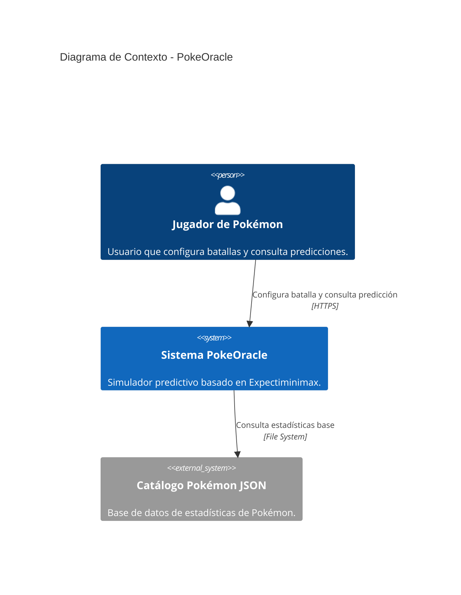
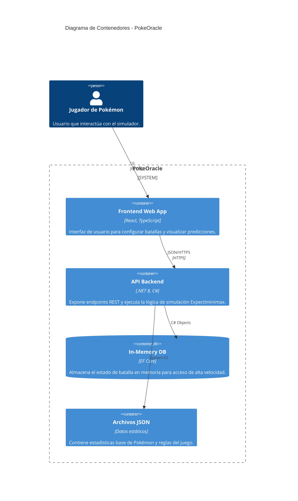
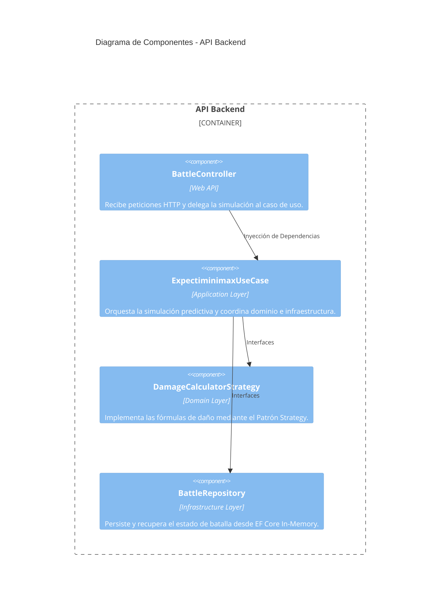

# Diagramas C4 - PokeOracle

## Nivel 1 — Contexto

```mermaid
C4Context
    title Diagrama de Contexto - PokeOracle

    Person(jugador, "Jugador de Pokémon", "Usuario que configura batallas y consulta predicciones.")
    System(pokeoracle, "Sistema PokeOracle", "Simulador predictivo basado en Expectiminimax.")
    System_Ext(catalogo, "Catálogo Pokémon JSON", "Base de datos de estadísticas de Pokémon.")

    Rel(jugador, pokeoracle, "Configura batalla y consulta predicción", "HTTPS")
    Rel(pokeoracle, catalogo, "Consulta estadísticas base", "File System")
```

## Nivel 2 — Contenedores

```mermaid
C4Container
    title Diagrama de Contenedores - PokeOracle

    Person(jugador, "Jugador de Pokémon", "Usuario que interactúa con el simulador.")

    System_Boundary(pokeoracle, "PokeOracle") {
        Container(frontend, "Frontend Web App", "React, TypeScript", "Interfaz de usuario para configurar batallas y visualizar predicciones.")
        Container(api, "API Backend", ".NET 8, C#", "Expone endpoints REST y ejecuta la lógica de simulación Expectiminimax.")
        ContainerDb(db, "In-Memory DB", "EF Core", "Almacena el estado de batalla en memoria para acceso de alta velocidad.")
        Container(json, "Archivos JSON", "Datos estáticos", "Contiene estadísticas base de Pokémon y reglas del juego.")
    }

    Rel(jugador, frontend, "UI", "HTTPS")
    Rel(frontend, api, "JSON/HTTPS", "HTTPS")
    Rel(api, db, "C# Objects", "")
    Rel(api, json, "System.IO", "")
```

## Nivel 3 — Componentes

```mermaid
C4Component
    title Diagrama de Componentes - API Backend

    Container_Boundary(api, "API Backend") {
        Component(controller, "BattleController", "Web API", "Recibe peticiones HTTP y delega la simulación al caso de uso.")
        Component(usecase, "ExpectiminimaxUseCase", "Application Layer", "Orquesta la simulación predictiva y coordina dominio e infraestructura.")
        Component(strategy, "DamageCalculatorStrategy", "Domain Layer", "Implementa las fórmulas de daño mediante el Patrón Strategy.")
        Component(repository, "BattleRepository", "Infrastructure Layer", "Persiste y recupera el estado de batalla desde EF Core In-Memory.")
    }

    Rel(controller, usecase, "Inyección de Dependencias", "")
    Rel(usecase, strategy, "Interfaces", "")
    Rel(usecase, repository, "Interfaces", "")
```
